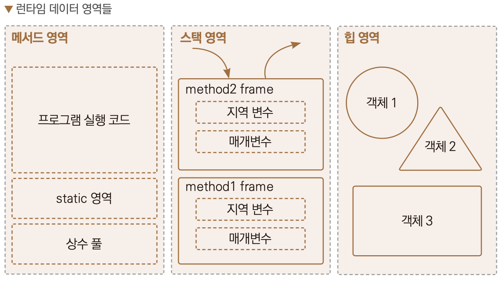

# 자바 기초 공부

<br><br>

## 클래스와 데이터 

<br>

### 클래스가 필요한 이유

- 특정 데이터들을 다루는데 하나하나 정의해서 출력하는건 귀찮다
- 배열로 데이터들을 하나로 묶어서 출력하는 방법이 있다
- 하지만 배열은 **특정 데이터를 정확하게 찾아서 제거하는데 한계**가 있다
- 이럴 때 클래스를 사용하면 된다

### 클래스와 사용자 정의 타입

- 사용자가 직접 정의 타입을 만드는 설계도: **클래스**
- 클래스를 사용해서 실제 메모리에 만들어진 실제: **객체, 인스턴스**

### 참조값
- Student student1 = new Student();
- 여기서 student1은 참조값으로 생성된 Student 메모리 주소를 보관
- 저장한 참조값을 통해 실제 메모리에 존재하는 객체에 접근

### 객체와 인스턴스
- 둘다 클래스에서 나온 실체라는 의미에서 비슷하게 사용되지만, 용어상 인스턴스는 객체보다 좀 더 관계에 초점을 맞춘 단어이다.
- 둘다 핵심 의미는 같기 때문에 보통 구분하지 않고 사용한다

<br>

> 자바에서 대입(=)은 항상 변수에 들어 있는 값을 복사해서 전달한다

> 인스턴스가 복사되는 것이 아니라 참조값만 복사 됨

<br><br><br>


## 기본형과 참조형

<br>

- 기본형: 변수에 사용할 값을 직접 넣을 수 있는 데이터 타입(`int`, `long`, `double`, `boolean`)
- 참조형: 데이터에 접근하기 위한 참조(주소)를 저장(`Student student`, `int[] students`)

<br>

> String은 사실 클래스다. 따라서 참조형이다. 그런데 기본형처럼 문자 값을 바로 대입할 수 있다.

<br>

### 기본형 vs 참조형
- 기본형은 들어있는 값을 그대로 계산할 수 있다
- 참조형은 들어있는 참조값을 그대로 사용할 수 없다
- 기본형, 참조형 모두 항상 **변수에 있는 값을 복사해서 대입**한다.
- 기본형 변수는 null을 할당할 수 없지만, 참조형 변수는 null을 할당할 수 있다.

### 변수의 종류
- 멤버 변수(필드): 클래스에 선언
- 지역 변수: 메서드에 선언

### 변수의 값 초기화
- 멤버 변수: 초기화
    - 인스턴스의 멤버 변수는 인스턴스를 생성할 때 자동으로 초기화
    - 숫자(int)=0, boolean = false, 참조형=null
    - 개발자가 초기값을 직접 지정할 수 있다
- 지역 변수: 수동 초기화

### Null
- 참조형 변수에서 아직 가리키는 대상이 없다면 null이라는 특별한 값을 넣을 수 있다.
- 만약 참조값 주소를 잃어서 메모리 누수가 발생한다면, JVM의 GC(가비지 컬렉션)가 인스턴스를 자동으로 메모리에서 제거한다

### NullPointerException
- **참조값이 없는데 객체를 찾으려고 할때** 발생하는 문제


<br><br><br>

## 객체 지향 프로그래밍

<br>

### 절차 지향 프로그래밍
- 실행 순서를 중요하게 생각하는 방식
- 프로그램의 **흐름을 순차적으로 따르며 처리**하는 방식, `어떻게`를 중심으로 프로그래밍

### 객체
- 세상의 모든 사물을 추상화하면 `속성`(데이터)과 `기능` 2가지로 되어 있다

**동물**
- 속성: 색상, 키, 온도
- 기능: 먹는다, 걷는다

**자동차**
- 속성: 차량 색상, 현재 속도
- 기능: 엑셀, 브레이크, 문 열기, 문 닫기

<br>

> 객체 지향 프로그래밍은 모든 사물을 속성과 기능을 가진 객체로 생각하는 것

<br>

### 객체 지향 프로그래밍
- 객체를 중요하게 생각하는 방식
- 실제 세계의 사물이나 사건을 객체로 보고, 이러한 **객체들 간의 상호작용을 중심**으로 프로그래밍하는 방식, `무엇을`을 중심으로 프로그래밍

### 둘의 차이점
- 절차 지향은 데이터와 해당 데이터에 대한 처리 방식이 분리되어 있다.
- 반면 객체 지향에서는 데이터와 그 데이터에 대한 행동이 하나의 '객체'안에 포함되어 있다.

### 절차 지향 프로그램의 한계
- 데이터와 그 데이터의 기능은 밀접한 연관이 있는데, 데이터와 데이터의 기능이 분리되어 있다 
- 유지보수 관점에서 관리 포인트가 2곳으로 늘어난다

### 인스턴스의 메서드 호출
- 객체는 자신의 메서드를 통해 자신의 멤버 변수에 접근할 수 있다
  - 객체의 메서드 내부에서 접근하는 멤버 변수는 객체 자신의 멤버 변수이다.

### 캡슐화
- 속성과 기능을 하나로 묶어서 필요한 기능을 메서드를 통해 외부에 제공하는 것

### this
- this는 **인스턴스 자신의 참조값**을 가리킨다. 즉, 필드에 접근하려면 앞에 this. 을 붙여주면 된다
- this()는 생성자 내부에서 다른 생성자를 호출할 수 있다
- this()는 생성자 코드의 첫줄에만 작성할 수 있다

<br>

> 참고로 `new` 키워드를 사용해서 객체를 생성할 때 마지막에 괄호()도 포함해야 하는 이유는 생성자 때문. 객체를 생성하면서 동시에 호출한다는 의미

<br><br><br>

## 패키지
- 컴퓨터가 파일을 분류하기 위해 폴더라는 개념을 사용하듯, 자바도 이런 개념을 제공: 패키지

### 클래스 불러오기
- 같은 클래스를 불러올때 패키지 경로를 써서 불러오면 된다
- 다른 패키지 클래스를 가져와 사용하고 싶으면 `import`를 쓰면 된다
  - `import`는 패키지명을 생략하고 클래스 이름만 적을 수 있다.
  - 만약 패키지 경로가 다른데 클래스 이름이 같다면?
    - ```java
      User userA = new User();
      pack.b.User userB = new pack.b.User();
      ```
    - import는 한개만 가능하므로 나머지는 경로를 써줘야 한다

<br><br><br>

## 접근제어자
- `private`: 모든 외부 호출을 막는다. 해당 클래스 내부에서만 호출할 수 있다.
- `default`(package-private): 같은 패키지안에서 호출 허용, 아무것도 안적으면 `default` 적용
- `protected`: 같은 패키지안에서 호출은 혀용한다. 패키지가 달라도 상속 관계의 호출은 허용한다
- `public`: 모든 외부 호출 허용


- private -> default -> protected -> public
- 생성자, 필드, 클래스, 메서드에서만 쓸 수 있다 -> 지역변수 x

<br>

> 좋은 프로그램은 무한한 자유가 주어지는 프로그램이 아니라 적절한 제약을 제공하는 프로그램이다

<br>

### 접근제어자 - 클래스 레벨
- 클래스 레벨 접근제어자는 `public`, `default`만 쓸 수 있다
- `public` 클래스는 반드시 파일명과 이름이 같아야 한다
  - 하나의 자바 파일에 `public`클래스는 하나만 등장할 수 있다
  - 하나의 자바 파일에 `default` 접근 제어자를 사용하는 클래스는 무한정 만들 수 있다

### 캡슐화
- 캡슐화를 안전하게 완성하는 것이 접근제어자다
- 접근제어자로 적절히 캡슐화하면 개발자 입장에서 해당 기능을 사용하는 복잡도를 낮출 수 있다
- 숨겨야 하는 것
  - 데이터
    - **데이터는 메서드를 통해 접근해야 한다**
    - `private`으로 설정
  - 기능
    - 내부에서 사용하는 기능
- 노출해야 하는 것
  - 외부에서 사용하는 기능

<br><br><br>

## 자바 메모리 구조
자바 메모리 구조는 메서드 영역, 스택 영역, 힙 영역 3개로 나눌 수 있다

- **메서드 영역**: 프로그램을 실행하는데 필요한 공통 데이터를 관리. 이 영역은 프로그램의 모든 영역에서 공유
  - 클래스 정보: 클래의 실행 코드, 필드, 메서드와 생성자 코드 등 모든 실행 코드 존재
  - static 영역: `static`변수들을 보관
  - 런타임 상수 풀: 프로그램을 실행하는데 필요한 공통 리터럴 상수 보관
- **스택 영역**: 실제 프로그램이 실행되는 영역. 메서드를 실행할 때 마다 하나씩 쌓인다
  - 스택 프레임: 스택 영역에 쌓이는 네모 박스가 하나의 스택 프레임이다. 메서드를 호출할 때마다 하나의 스택 프레임이 쌓이고, 메서드가 종료되면 해당 스택 프레임이 제거된다
- **힙 영역**: 객체와 배열이 생성되는 영역
  - 가비지 컬렉션이 이루어지는 주요 영역

<br>

> 스택 영역은 각 스레드 별로 하나의 실행 스택이 생성된다

<br>

### 메서드 코드는 메서드 영역 
- 객체를 생성할때 내부 변수값은 힙 영역에 할당되지만, 메서드는 메서드 영역에서 공통으로 관리되고 실행된다
- 즉, 인스턴스의 메서드를 호출하면 실제로 메서드 영역에 있는 코드를 불러서 수행

### static 변수
- 주로 멤버 변수와 메서드에 사용된다
- 클래스 변수, 정적 변수, static 변수라고 불림
- `static` 키워드를 사용하면 **공용으로 함께 사용하는 변수**를 만들 수 있다
- 생성된 객체에서 값을 불러올때, 클래스명에 `.`을 찍어 사용한다
- `static`이 붙은 멤버 변수는 메서드 영역에서 관리, 힙 영역 x
- `static`이 정적 변수인 이유는 프로그램 실행 시점에 만들어지고, 프로그램이 종료 시점에서 제거되어서다.
- JVM 시작시 만들어지고, JVM 종료시 제거됨

<br>

> 메서드 영역에서 관리한다는 것은 공용으로 사용한다는 것을 관리한다는 뜻이다

<br>

- **지역 변수**: 스택 프레임 안에서 호출
- **인스턴스 변수**: 힙 영역 안에서 사용
- **클래스 변수**: 메서드 영역의 static 영역에 보관되는 변수

### static 메서드 
- 단순 기능만 제공하는 메서드의 경우 static 메서드를 사용하는게 좋다
- 즉, 객체 생성이 필요 없이 **메서드의 호출만으로 필요한 기능을 수행할 때** 주로 사용
- 클래스 메서드, 정적 메서드, static 메서드라고 불린다
- 클래스 메서드인 이유는 인스턴스 생성 없이 클래스에 있는 메서드를 바로 호출하는 것처럼 느껴지기 때문

- ```
  import static static2.DecoData.*;
  staticCall();
  ```
- import를 하면 클래스명을 생략할 수 있다. 위 예제는 DecoData를 생략해서 호출

### 인스턴스 메서드
- `static`이 붙지 않는 메서드는 인스턴스를 생성해야 호출할 수 있다. 이것이 인스턴스 메서드다

### main() 메서드는 정적 메서드
- main() 메서드는 객체를 생성하지 않아도 실행됐다. `main()` 메서드가 `static`이기 때문
- 정적 메서드는 같은 클래스 내부에서 정적 메서드만 호출할 수 있다
- 따라서 main()에서 같은 클래스 안에 메서드를 호출시 정적 메서드로 선언해서 사용

<br><br><br>

## final
- 변수에 final 키워드가 붙으면 값 변경 불가
- final은 `class`, `method`를 포함한 여러 곳에서 붙을 수 있다
- final을 지역 변수에 할당할 경우 최초 한번만 가능
- final을 매개변수에 붙이면 메서드 내부에서 매개변수 값을 변경할 수 없음
- final을 필드에 사용할 경우, 생성자를 통해 한번만 값을 할당할 수 있다

### static final
- 같은 객체를 계속 생성할때 final 필드를 필드에서 초기화하는 경우, 필드는 모두 같은 값을 가지게 됨. 불필요한 중복
- 이때 사용하기 좋은게 static final
- static 영역은 단 하나만 존재하기 때문에 중복과 메모리 비효율 문제를 해결할 수 있다

_final + 필드 초기화의 경우, 앞에 static을 붙여서 사용_

### 상수
- **상수**: `static final`이 붙은 변수. 변하지 않고, 항상 일정한 값을 갖는 수
- 대문자를 사용하고 구분은 `_`로 한다(관례)
- 필드를 직접 접근해서 사용(public 자주 사용)

### final 변수와 참조
- final이 붙은 참조형은 다른 참조값으로 변경할 수 없다
- 참조대상의 객체 값은 변경할 수 있다